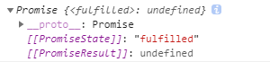

### `异步加载图片体验体验js任务操作`
```js
function loadImg(src,resolve,reject) {
  let image = new Image();
  console.dir(image);
  image.src = src;
  image.onload = () => resolve(image),
  image.onerror = reject;
}
loadImg(
  './assets/arguments.png',
  image=>document.body.append(image),
  () => console.log('加载失败！')
)
```
### `定时器的任务轮询`
```html
<div style="width: 300px;height: 300px;background-color: blue;position: relative;"></div>
<script>
  "use strict"
  window.onload = function () {
    function interval(callback, delay = 100) {
      let id = setInterval(()=>callback(id),delay)
    }
    interval((timeId)=>{
      const div = document.querySelector('div');
      let left = parseInt(window.getComputedStyle(div).left)
      div.style.left = left + 10 + 'px';
      if (left >= 200) {
        clearInterval(timeId)
      }
    })
  }
</script>
```
### `通过文件依赖了解任务排序`
```js
function load(src, resolve) {
  let script = document.createElement("script");
  script.src = src;
  script.onload = resolve;
  document.body.appendChild(script)
}
```

### `Ajax异步请求任务管理`
```js
function ajax(url, callback) {
  let xhr = new XMLHttpRequest();
  xhr.open('GET', url);
  xhr.send();
  xhr.onload = function(){
    if (this.status === 200) {
      callback(JSON.parse(this.response))
    } else {
      throw new Error('加载失败！')
    }
  }
}
```

### `Promise微任务处理机制`
```js
//new的时候是准备状态
new Promise((resolve, reject)=>{
  resolve('操作成功！')
})//then是执行完之后要做的事
.then(
  value => {console.log(value);},
  reason => {console.log(reason);}
)
```
### `宏任务与微任务执行顺序`
```js
//#0
setTimeout(() => {
  console.log('setTimeout');
}, 0);
//#1
new Promise(resolve => {
  //#2
  resolve()
  console.log('promise');
})
//#3
.then(value=>console.log('成功'))
//#4
console.log('执行完毕');
//依次打印 promise  执行完毕  成功  setTimeout 
//#1和#4是同步任务，依次执行，到#2是异步任务，#3会被加入到微任务队列，#2执行完毕返回值后执行#3
//#0是宏任务，同步和微任务执行完毕后执行微任务
```
### `宏任务的提升原来是误解`
```js
new Promise(resolve => {
  setTimeout(() => { //创建宏任务
    console.log('setTimeout1');
    resolve() //创建微任务
    console.log('setTimeout2');
  }, 0);
  console.log('promise');
})
.then(value=>console.log('成功'))
console.log('执行完毕');
//依次打印 promise  执行完毕 setTimeout1  setTimeout2  成功 
//这段代码中，宏任务执行后才创建微任务（宏任务不执行，微任务就无法生成）
//主线程执行完之后，才会去轮询微任务，然后去轮询宏任务
```

### `Promise单一状态与状态中转`
promise有三种状态：
* pending ：准备状态
* fulfilled ：已完成
* rejected ：已失败
状态一旦改变，无法可逆

### `Promise.then的用法`
```js
//示例1
new Promise((resolve,reject)=>{
  reject('reject')
})
.then(null,error=>console.log(error)) //.then会一直向下传递,then也会返回一个promise
.then(value=>console.log('then2',value),error=>error)  //then2 undefined
//示例2  then是对上一个promise的处理
new Promise((resolve,reject)=>{
  reject('reject')
})
.then(value=>value,error=>error) //error reject
.then(value=>console.log('value',value),error=>console.log('error',error)) //value reject
```

### `其他类型的Promise封装`
```js
new Promise((resolve,reject)=>{
  resolve('fulfilled')
  // reject('rejected')
})
.then(
  value => {
    return { //对象会被封装成Promise返回
      then(resolve,reject) { //相当于.then方法接收Promise
        resolve('这是对象')
      }
    }
  },
  reason => {
    return class { //也可以使用类进行封装
      static then(resolve, reject) {
        reject('这是类')
      }
    }
  }
)
.then(
  value => {
    console.log(value); //这是对象
  },
  reason => {
    console.log(reason); //这是类
  }
)
```


### `使用Promise封装AJAX异步请求`
```js
function ajax(url) {
  return new Promise((resolve,reject)=>{
    let xhr = new XMLHttpRequest();
    xhr.open('GET', url);
    xhr.send();
    xhr.onload = function(){
      if (this.status === 200) {
        resolve(JSON.parse(this.response))
      } else {
        reject('加载失败！')
      }
    }
    xhr.onerror = function(){
      reject(this)
    }
  })
}
```


### `Promise多种错误监测与catch使用`
```js
//示例1
new Promise((resolve, reject)=>{
  throw new Error('出错了！')
})
.then(
  value=>{},
  reason => {
    console.log(reason.message) //出错了！
  }
)
//示例2
new Promise((resolve, reject)=>{
  sss + 1; //内部相当于有一个try catch机制，是系统自动帮我们抛出来的
})
.then(
  value=>{},
  error => {
    console.log(error.message) //sss is not defined
  }
)
//示例3
new Promise((resolve, reject)=>{
  reject('出错1')
})
.then(
  value=>{
    return new Promise((resolve, reject)=>{
      reject('出错2')
    })
  }
)//可以用catch统一处理，如果前面.then都有错误处理，就不会再到catch这儿
.catch(error=>{console.log(error)}) //出错1
```

### `自定义错误处理`
```js
class ParamError extends Error {
  constructor(msg) {
    super(msg)
    this.name = 'ParamError'
  }
}
function ajax(url) {
  return new Promise((resolve,reject)=>{
    if (!/^http/.test(url)) {
      throw new ParamError('请求地址格式错误')
    }
    //...
  })
}
ajax('ttp://...')
.then(res=>{console.log(res)})
```

### `Promise异步加载图片`
```js
function loadImage(src) {
  return new Promise((resolve,reject)=>{
    const image = new Image();
    image.src = src;
    image.onload = () => {
      resolve(image)
    };
    image.onerror = reject;
    document.body.appendChild(image)
  })
}
loadImage('./assets/arguments.png')
.then(image=>{
  image.style.border = 'solid 2px red'
})
```

### `封装setTimeout定时器`
```js
function timeout(delay=1000){
  return new Promise(resolve=>setTimeout(resolve, delay))
}
timeout()
.then(()=>{
  console.log('print 1')
  return timeout(1000)
})
.then(()=>console.log('print 2'))
```

### `构建扁平化的setInterval`
```js
function interval(delay=1000,callback){
  return new Promise(resolve=>{
    let id = setInterval(()=>{
      callback(id, resolve)
    },delay)
  })
}
interval(1000, (id, resolve)=>{
  console.log(12);
  clearInterval(id)
  resolve()
})
.then(value=>{
  console.log('成功');
})
```


### `script脚本的Promise加载引擎`
```js
function loadScript() {
  return new Promise((resolve,reject)=>{
    const script = document.createElement('script');
    script.src = src;
    script.onload = ()=>resolve(script);
    scipt.onerror = reject;
    document.body.appendChild(script);
  })
}
loadcript('js/a.js')
.then(script=>console.log(script)) //<script src='js/a.js'></script>
```

### `Promise.resolve缓存后台数据`
```js
//例如
Promise.resolve('user:tom').then(value=>console.log(value))//user:tom
//小例子
function query(name) {  //函数也是一个对象
  const cache = query.cache || (query.cache = new Map()) //查询query里是否有缓存，没有就创建
  if (cache.has(name)){
    return Promise.resolve(cache.get(name))
  }
  return ajax(``).then(
    user=>{
      cache.set(name,user);
      return user
    }
  ) 
}
```


### `Promise.reject使用`
```js
//例子
let user = {
  then(resolve,reject){
    resolve('后盾人')
  }
};
Promise.resolve(user).then(value=>console.log(value))
Promise.reject('fail').then(value=>console.log(value)).catch(error=>console.log(error))
```


### `Promise.all批量获取数据`
返回的全部是已解决状态，有一个错误就不返回
```js
const promise1 = new Promise((resolve,reject)=>reject('fail'))
const promise2 = new Promise((resolve,reject)=>resolve('success'))
Promise.all([promise1,promise2]).then(result=>console.log(result)).catch(error=>console.log(error)) //fail
//例如：批量获取用户资料
const promises = ['tom','jack'].map(name=> fetch(`http://public-api-v1.aspirantzhang.com/users?name=${name}`))
Promise.all(promises).then(users=>console.log(users))
```

### `Promise.allSettled的使用`
不管状态是否全部解决，都会一一返回，即未解决的也会返回
```js
const promise1 = new Promise((resolve,reject)=>{
  resolve('成功！')
})
const promise2 = new Promise((resolve,reject)=>{
  reject('失败！')
})
Promise.allSettled([promise1,promise2])
.then(res=>console.log(res))
```


### `Promise.race后台请求超时处理`
也可以请求多个promise，但只会返回一个，哪个快用哪个
```js
let promise = [
  fetch(`http://user.com`),
  new Promise((resolve,reject)=>{
    setTimeout(()=>{
      reject('请求超时')
    },2000)
  })
];
Promise.race(promise)
.then(value=>console.log(value))
.catch(error=>console.log(error))
```

### `Promise队列原理`
只要返回promise，就可以实现队列操作


### `使用Map实现Promise队列`
```js
function queue(num) {
  let promise = Promise.resolve();
  num.map(v=>{
    promise = promise.then(_=>{
      return new Promise(resolve=>{
        setTimeout(()=>{
          console.log(v);
          resolve();//一定要结束pedding状态，否则下一个promise无法接收值
        })
      })
    })
  })
}
queue([p1,p2])
```


### `reduce封装Promise队列`
```js
function queue(num) {
  num.reduce((promise,n)=>{
    return promise.then(_=>{
      return new Promise(resolve=>{
        console.log(n);
        resolve()
      })
    })
  },Promise.resolve())
}
queue([1,2,3,4])
```

### `async与await语法糖`
async是promise的语法糖，await的语法糖
```js
async function user() {}
console.log(user());
```

```js
async function user(){
  let name = await 'tom';
  console.log(name)
}
user() //tom
```
```js
async function user(){
  let name = await new Promise(resolve=>{
    setTimeout(()=>{
      resolve('tom')
    },1000)
  });
  let another = await new Promise(resolve=>{
    setTimeout(() => {
      resolve(name+'jack')
    }, 1000);
  })
  console.log(another)
}
user() //两秒后打印tomjack
```

### `async延时函数`
```js
async function sleep(delay=2000) {
  return new Promise(resolve => {
    setTimeout(() => {
      resolve()
    }, delay);
  })
}
async function show() {
  for(const user of ['tom','jack','lucy']) {
    await sleep()
    console.log(user);
  }
}
show()//tom   jack   lucy  每隔两秒打印
```

### `await制作加载进度条`
```html
<body>
  <div id="loading" style="height: 30px;background-color: green;line-height: 80px;text-align: right;color: #fff;padding-right: 5px;">0%</div>
  <script>
    "use strict"
    function query(name) {
      return aiax(`http://user.com?name=${name}`)
    }
    async function loadUser(users) {
      let loading = document.getElementById('loading');
      for(let i = 0;i<users.length;i++) {
        let user = await query(user[i]);
        let progress = ((i+1)/user.length)*100
        loading.style.width = progress + '%'
        loading.innerHTML = progress + '%'
      }
    }
    loadUser(['tom','jack'])
  </script>
</body>
```


### `class与await的结合`
```js
class User {
  constructor(name){
    this.name = name;
  }
  then(resolve,reject) {
    let user = ajax(`http://user.com?name=${this.name}`)
    resolve(user)
  }
}
async function get() {
  let user = await new User('jack')
  console.log(user);
}
```


### `异步封装在类内部`
```js
class User {
  async get(name) {
    let user = ajax(`http://user.com?name=${name}`)
    user.name += 'he is'
    return user
  }
}
new User().get('tom').then(user=>console.log(user))
```


### `async与await多种声明`
```js
//函数
async function() {
  let user =  await ajax();
}
//对象
let user = {
  async get(){}
}
//类
class User{
  async get(){}
}
```


### `标准的await错误处理流程`
```js
//在里面处理
async function user(name){
  try {
    let user = await ajax(`http://baidu.com`)
  } catch (error) {
    console.log(error);
  }
}
//在外面处理
async function user(name){
  return await ajax(`http://baidu.com`)
}
user('tom').then(value=>console.log(value)).catch(error=>console.log(error))
```


### `await并行执行技巧`
```js
function p1() {
  return new Promise(resolve=>{
    setTimeout(() => {
      resolve('tom')
    }, 2000);
  })
}
function p2() {
  return new Promise(resolve=>{
    setTimeout(() => {
      resolve('jack')
    }, 2000);
  })
}
async function user() {
  let user1 = p1();
  let user2 = p2();
  //此时是两个promise在同时执行
  let value1 = await user1;
  let value2 = await user2;
  console.log(value1, value2); //tom jack
}
```


