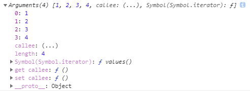

### `函数的声明`
```js
let fun = new Function('name','console.log(name)') //函数其实是一个object类型
function fun(name){console.log(name)}//会声明到全局作用域（模块化除外），即可使用window.fun()调用，不建议使用独立函数，建议都放在类中
let fun = function(name){console.log(name)}//与上一行的区别在于不会不会存在与全局作用域
```

### `立即执行函数表达式`
一个项目中可能会应用多个库，每个库中的函数名可能会一样而导致引用时引用不全或引用错误。为防止该情况发生，之前一般采用立即执行表达式解决，现多采用模块化
```js
(function(window) {
  function name() {
    console.log('name');
  }
  function age() {
    console.log('age');
  }
  window.kuMing = {name, age}
})(window)
kuMing.name()  // name

//也可以开辟一个块作用域
{
  function name() {
    console.log('name');
  }
  function age() {
    console.log('age');
  }
  window.kuMing = {name, age} 
}
kuMing.name()  // name
```

### `arguments`
```js
function num(...a) {
  console.log(a); //[1,2,3,4]
  console.log(arguments); //打印结果1
  console.log(arguments.length) //可以获取函数接收了几个参数
}
num(1,2,3,4)
```
打印结果1：

```js
//老的求和写法
function sum() {
  let total = 0;
  for(const i = 0; i < arguments.length; i++) {tatal += arguments[i]}
  return total
  //更简洁写法: return [...arguments].reduce((a,b)=>a + b)
}
//新的写法
function sum(...args) {return args.reduce((a,b)=>a + b)}
```

### `递归`
```js
function jieCheng(num) {
  return num === 1 ? 1 : num * jieCheng(--num)
}
function sum(...args) {
  return args.length === 0 ? 0 : args.pop() + sum(...args)
}
function printXing(sum) {
  return sum ? document.write('*'.repeat(sum)+'<br/>') || printXing(--sum) : ''
  //console.log(document.write('*'.repeat(sum)+'<br/>'))  //udefined
}
```