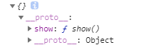
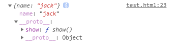

### `没有原型的对象也是存在的`
```js
let user = Object.create(null,{
  name: {
    value: 'tom'
  }
})
console.log(user) //{name:'tom'},它已经没有了__proto__属性，即没有原型
```
### `原型方法与对象方法优先级`
```jsx
let user = {
  name(){
    console.log('own function');
  }
}
user.__proto__.name = function() {console.log('father function')} //给user的父级添加一个方法
user.name()//own function   对象方法优于原型方法
```
### `函数拥有多个原型`
```jsx
function User() {}
console.dir(User)
```

### `原型中的constructor引用`

### `原型链`
```js
let arr = [];
arr.__proto__.__proto__ === Object.prototype
//arr.__proto__不是标准的操作原型的方式，一般使用Object.getprototypeof(arr)
```

### `instanceof原型检测`
```js
function A() {}
let a = new A()
console.log(a instanceof A) //判断a这个原型链上是否有A这个构造函数的原型(A.prototype)
```

### `isPrototypeOf原型检测`
```js
function A() {}
let a = new A()
console.log(A.prototype.isPrototypeOf(a)) //trues
```

### `in与hasOwnProperty的属性检测`
```js
let a = { name: 'tom' }
let b = { age: 18 }
Object.setPropertyOf(a,b)//将b设置为a的原型
console.log("age" in a )//true
//in会检测属性是否会在对象或者对象的原型链上出现
console.log(a.hasOwnProperty('name'))//true
console.log(a.hasOwnProperty('age'))//false
//hasOwnProperty只检测对象本身
```

### `使用call或apply借用原型链`
```js
//使用apply
let hd = {
  data: [1,2,3,4,5]
}
Object.setPrototypeOf(hd, {
  max() {
    return this.data.sort((a,b)=>b-a)[0]
  }
})
console.log(hd.max());
let xj = {
  lessons:{js:15,css:46},
  get data(){
    return Object.values(this.lessons)
  }
}
console.log(hd.max.apply(xj));
//使用call
let hd = {
  data: [1,2,3,4,5]
}
Object.setPropertyOf(hd, {
  max(data) {
    return data.sort((a,b)=>b-a)[0]
  }
})
let xj = {
  lessons: {js:23,css:80}
}
console.log(hd.max.call(null,Object.values(xj.lessons)))
//优化代码
let hd = {
  data: [1,2,3,4,5]
}
console.log(Math.max.apply(null,hd.data))
let xj = {
  lessons: {js:23,css:80}
}
console.log(Math.max.apply(null,Object.values(xj.lessons)))
```

### `DOM节点借用Array原型方法`
```js
let btns = document.querySelectorAll("button")
btns = Array.prototype.filter.call(btns, item => {
  return item.hasAttribute("class")
})
```

### `合理的构造函数方法声明`
```js
//一些公共的方法可以放在原型上，避免每次创建实例时消耗内存空间
function User(name) {
  this.name = name;
}
User.prototype = {
  constructor: User,//确保能够通过原型再找到函数
  show() {
    console.log(this.name);
  }
}
const user = new User('TOM')
user.show()
console.dir(User);
```

### `this和原型没有关系`
this与原型没有什么关系，它始终指向的是调用这个属性的对象

### `不要滥用原型`
```html
<button onclick="this.hide()">btn</button>
<script>
  //this指向的始终是调用它的对象，也就是button
  Object.prototype.hide = function () {
    this.style.display = "none"
  }//这样滥用会导致引外部库时重名
</script>
```

### `Object.create与__proto__`
```js
let user = {
  show() {
    return this.name;
  }
}
//定义对象的原型，不能获取
let u = Object.create(user);
console.log(u)
u.name = 'tom';
console.log(u.show())//tom
```

```js
let user = {
  show() {
    return this.name;
  }
}
let uu = Object.create(user,{
  name: {
    value: 'jack'
  }
});
console.log(uu)
```

```js
//使用__proto__，有值时设置，无值时获取
let user = {
  show() {
    return this.name;
  }
}
let u = { name: 'tom' };
u.__proto__ = user;
console.log(u)
```

### `__proto__其实是属性访问器`
```js
let user = {name:'tom'};
user.__proto__ = {
  show() {
    console.log(this.name)
  }
}
user.__proto__ = 'jack';//设置不成功（其实__proto__是个访问器属性）
user.show()//name
//如何实现的呢
let user = {
  action: {},
  get __proto__() {
    return this.action
  },
  set __proto__(obj) {
    if (obj instanceof Object) { 
      this.action = obj
      console.log(this.action)
    }
  }
}
user.__proto__ = {age:18}//{age:18}
//如果我就想设置原型为字符串呢
let user = Object.create(null)
user.__proto__ = 'jack';
console.dir(user.__proto__) //jack
```

### `继承是原型的继承`