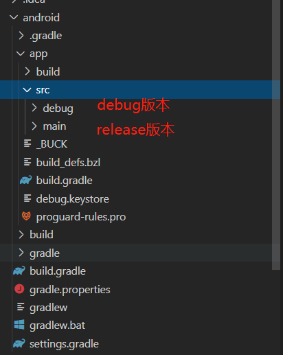
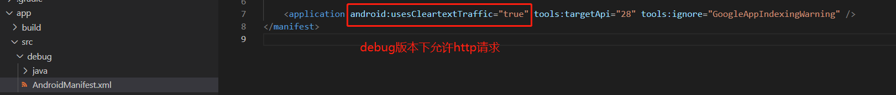

### `允许http请求`
---
在ios,android中只允许https请求，不允许http，为开发方便，需配置



* ios下的配置

react-native已经帮我们配好了，ios上架过程中可能会遇阻，到时候再在NSExceptionDomains里单独配

### `更改打包后apk的名字`
进入：android/app/src/main/res/valuse/strings.xml目录下
```xml
<resources>
  <string name="app_name">你的APP名称</string>
</resources>
```

### `更改打包后apk的图片`
进入：android/app/src/main/res/目录下，有类似mipmap-hdpi,mipmap-mdpi,mipmap-xhdpi,mipmap-xxhdpi,mipmap-xxxhdpi等文件，<br>
这些文件下分别存有png格式的图片，图片大小分别为：72x72，48x48，96x96，144x144，192x192格式<br>
注意：原始图片必须为png格式，否则报错

