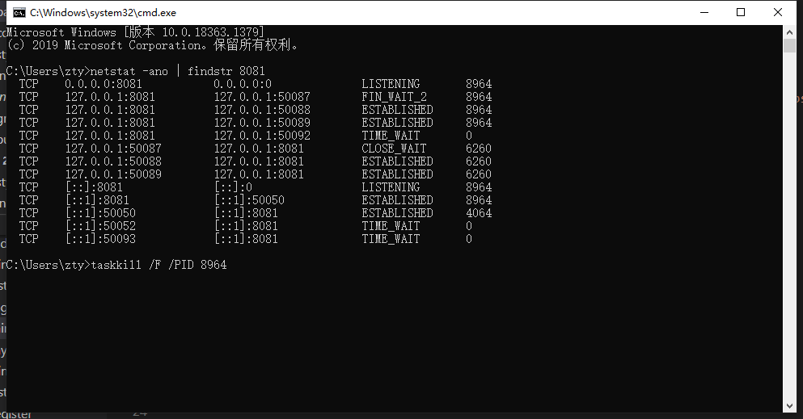

### `processDebugResources failed`
报错：<br>
> Task :app:processDebugResources FAILED<br>

解决方法：依次执行如下命令
```bash
$ cd android
$ ./gradlew clean
```
### `杀死端口占用的进程`
解决方法：在cmd中依次执行如下命令
```bash
$ netstat -ano | findstr 8081
$ taskkill /F /PID 17720
```
