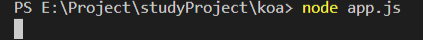
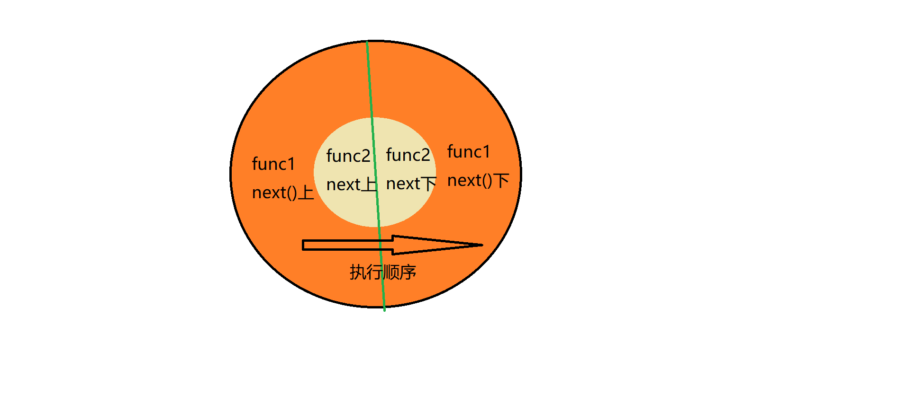
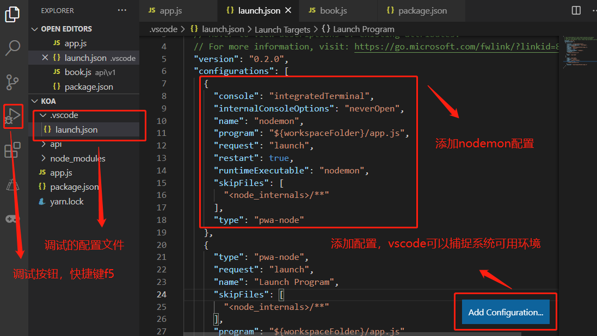

### `koa的启动`

```js
const Koa = require('koa');
const app = new Koa();
app.listen(3000)
```
运行 node app.js后只要没报错，就说明启动成功了，如下图会看到命令行仿佛卡顿了，其实它是处于阻塞的状态，这样才能监听前端的http请求


### `中间件`
中间件其实就是函数，如何把函数变成中间件呢？把函数注册到应用程序上即可
```js
//注册
function test() {
  consoe.log('hello');
}
app.use(test)
//一般使用匿名函数写法
app.use(()=>console.log('hello'))
//在浏览器访问localhost:3000时就会打印 hello
//一个应用程序可以注册多个中间件

//koa在调用中间件时都会传入两个参数(koa内部机制自动传入的)
app.use((ctx,next)=>{
  //ctx是上下文
  //next是下一个中间件函数
  next()//运行下一个中间件，中间件是按注册顺序从上往下运行的
})
```

### `洋葱模型`
```js
app.use(async (_,next)=>{
  console.log(1);
  await next();
  console.log(2);
})
app.use(async (_,next)=>{
  console.log(3);
  await next();
  //next()返回的是一个promise
  console.log(4);
})
//打印顺序 1342
//执行顺序遵循洋葱模型
//若不加async和await很难保证所有的中间件按洋葱模型运行
```


### `async和await`
await可以当作是求值关键字，即await可以计算promise
```js
function a() {
  return new Promise((resolve,reject)=>{
    resolve('success')
    // reject('error')
  })
}
async function c (){
  const b = await a()
  console.log(a()); //Promise {<fulfilled>: "success"}
  console.log(b); //success
}
c()
function a() {
  return new Promise((resolve,reject)=>{
    setTimeout(() => {
      resolve('success')
    }, 1000);
    // reject('error')
  })
}
async function c (){
  const b = await a()
  console.log(a());
  console.log('b',b);
}
c()
console.log('执行完毕'); //'执行完毕'
//打印顺序  执行完毕 Promise {<pending>}  b success
```
```js
function a() {
  return new Promise((resolve,reject)=>{
    // resolve('success')
    reject('error')
  })
}
async function c (){
  console.log(a()); //Promise {<rejected>: "error"}
  const b = await a()//报错Uncaught (in promise) error
  //上面报错后，下面的不再执行
  console.log(a());
  console.log('b',b); //success
}
c()
console.log('执行完毕'); //'执行完毕'
```
由上述两个例子可以看出，只有promise返回成功时才能从await中拿到值
```js
//await不仅仅只对promise求值，也可以对表达式求值
async function a(){
  const b = await 100+100
  console.log(b)//200
}
//await是会阻塞当前的线程的
async func() {
  const axios = require('axios');
  const start = Date.now();
  const res = axios.get('http://7yue.pro')
  const end = Date.now();
  console.log(end - start);//0
  //程序从上到下运行，并不会被阻塞
}
async func() {
  const axios = require('axios');
  const start = Date.now();
  const res = await axios.get('http://7yue.pro')
  const end = Date.now();
  console.log(end - start);//80
  //程序从上到下运行，加上await后，会阻塞线程，即请求完成后才会运行const end = Date.now();
}
//在函数的前面加上async，那么这个函数的返回值都会被包装成promise
```

### `为什么一定要保证洋葱模型`
要保证洋葱模型，每一个中间件的next()前面必须加上await
```js
//可以通过ctx在中间件间传值
app.use(async (ctx, next)=>{
  console.log(1);
  const res = await next();
  const r2 = ctx.r2
})
app.use(async (ctx, next)=>{
  console.log(1);
  const res = await axios.get('http://www.baidu.com')
  ctx.r2 = res;
  await next();
})
```

### `常用插件`
* sequelize 操作数据库,可以自动帮我们生成数据表
* koa-router
* nodemon 服务器热启动
安装：
```bash
$ npm i nodemon -g
```
使用方法：
```bash
$ nodemon app.js
```
如果想让vscode的f5调试和nodemon同时可以使用，可以对vscode的调试进行配置


* require-directory 自动导入路由并注册中间件

