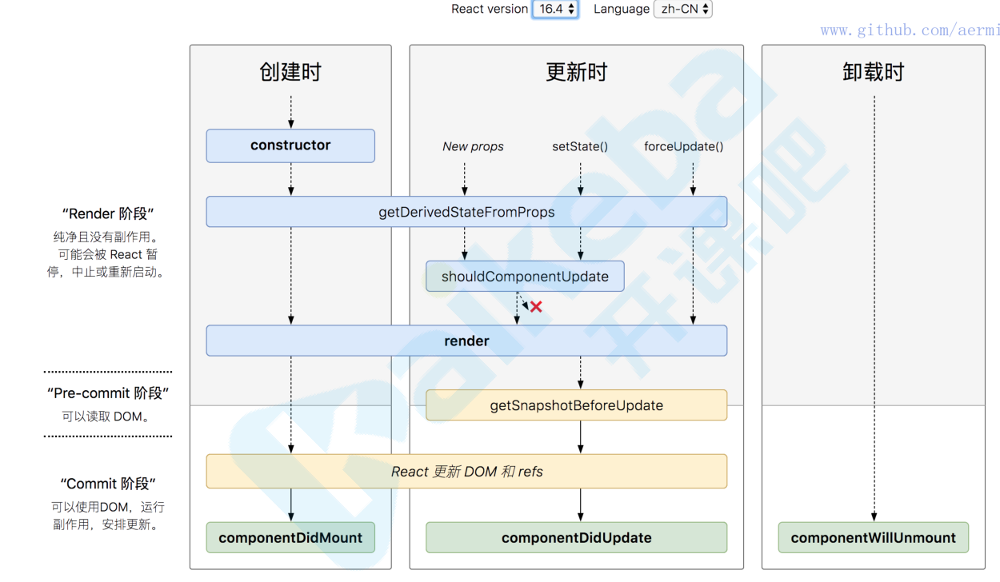

### `react 16.3之前的生命周期`
* constructor()
* componentWillMount()
* render()
* componentDidMount()
* componentWillReceiveProps(nextProps)
* shouldComponentUpdate(nextProps,nextState)
* forceUpdate()
* compontWillUpdate(nextProps,nextState)
* componentDidUpdate()
* componentWillUnmount()
```jsx
handleClick(){
  this.forceUpdate()//强制再次render
}
```

### `react16.4之后`
废弃了三个生命周期（在使用时要在前面加UNSAFE_）:
* componentWillMount()
* componentWillReceiveProps(nextProps)
* compontWillUpdate(nextProps,nextState)
同时引入了两个新的生命周期:
* static getDerivedStateFormProps
```jsx
static getDerivedStateFormProps(props,state) {
  //getDerivedStateFormProps会在调用render方法之前调用，并且在初始挂载及后续更新时都会调用
  //它会返回一个对象来更新state，如果返回null则不更新任何状态
  //初始挂载时会在constructor后面，render前面执行
  //页面状态更新时在shouldComponentUpdate之前执行一次，在
  const { counter } = state;
  return counter < 8 ? null : { count : 0 }
}
```
* getSnapshotBeforeUpdate <br>
getSnapshotBeforeUpdate在最近一次渲染输出之前调用，它使得组件能在发生更改之前从DOM中捕获一些信息（例如：滚动位置），此生命周期的任何返回值将作为参数传递给componentDidUpdate，此用法并不常见，但它可能出现在UI处理中，例如需要以特殊方式处理滚动位置的聊天线程等。
```jsx
static getDerivedStateFormProps(preProps，preeState){
  //执行在render之后，compontentDidUpdate之前调用，
  const { counter } = preState;
  return null
}
```


### `变更原因`
原来（React v16.0前）的生命周期在React v16推出的Fiber之后就不合适了了，因为如果要开启async rendering，在render函数之前的所有函数，都有可能被执⾏多次。如果开发者开了async rendering，而且又在以上这些render前执行的生命周期方法做AJAX请求的话，那AJAX将被无谓地多次调用。明显不是我们期望的结果。而且在componentWillMount里发起AJAX，不管多快得到结果也赶不不上首次render，而且componentWillMount在服务器端渲染也会被调用到（当然，也许这是预期的结果），这样的IO操作放在componentDidMount里更合适。禁⽌止不能用比劝导开发者不要这样用的效果更好，所以除了shouldComponentUpdate，其他在render函数之前的所有函数（componentWillMount，componentWillReceiveProps，componentWillUpdate）都被getDerivedStateFromProps替代。
